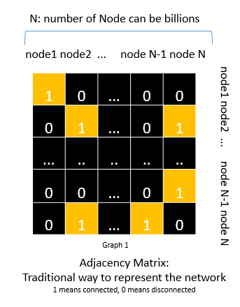
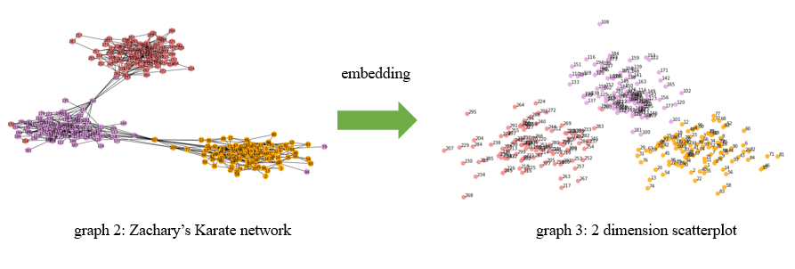

## Introduction:  Network Embedding (DeepWalk Method)Applications
- **Network embedding methods aim at learning low-dimensional latent representation of nodes
in a network**. These representations can be used as features for a wide range of tasks on graphs
such as classification, clustering, link prediction, and visualization
- As we know,Given a network’s structure, **it is often desirable to predictmissing information (frequently called attributes or labels)** associated with each node in the graph,for exmaple on a social
network they might represent the communities a person belongs to, or the categories of a document’s
content on the web but in the real-world social network, information networks can contain billions of nodes and edges and the adjacency matrix (graph 1), a traditional way to present a network is intractable to perform complex inference procedures on the entire network.
- One technique which has been proposed to address this problem is network embedding. The central idea is to find a mapping
function which converts each node in the network to a low-dimensional latent representation. These
representations can then be used as features for common tasks on graphs such as classification,
clustering, link prediction, and visualization.

- Scenario: I create the random connected network with 500 nodes to demostrate the application of network embedding. You can see the social network has 3 communities (graph 2). We convert it to be a 2 dimension graph (graph 3)

References:
Haochen Chen, Bryan Perozzi2, Rami Al-Rfou2, and Steven Skiena1: A Tutorial on Network Embeddings. August 9, 2018
https://arxiv.org/pdf/1808.02590.pdf

# Network Embedding 实例代码与应用

- 简介：网络嵌入方法（Network Embedding）旨在学习网络中节点的低维度潜在表示，所学习到的特征表示可以用作基于图的各种任务的特征，例如分类，聚类，链路预测和可视化。

- 缘由：正如我们知道， 当给定一个社交网络的结构，我们可以预测与节点关联的缺失信息，例如说在一个社交网络图中我们去判断这个是属于哪个社群，或者在网络上的一个网页是属于哪个类别但是由于信息网络可能包含数十亿个节点和边缘，例如用传统的表达发现Adjacency Matrix (graph 1) 去表达一个社交网络结构，但是这种传统的网络表示结构会使得在整个网络上执行复杂的推理过程可能会非常棘手。

- 目的：我们可以使用一种技术来解决这种问题的方式就是网络嵌入 network embedding， 其中心思想就寻找一个映射函数将每一个节点映射到低位的空间。这种低纬度空间表达方式看看做特征用于常见的应用场景，例如分类，距离，链接判断以及可视化。

- 本文将实现以DeepWalk方式实现基于深度学习社区技术的网络嵌入方法，而DeepWalk就是通过将节点视为单词并生成短随机游走作为句子来弥补网络嵌入和单词嵌入之间的差距。然后，可以将诸如 Skip-gram 之类的神经语言模型应用于这些随机游走以获得网络嵌入。

References:
Haochen Chen, Bryan Perozzi2, Rami Al-Rfou2, and Steven Skiena1: A Tutorial on Network Embeddings. August 9, 2018
https://arxiv.org/pdf/1808.02590.pdf

- 场景： 我创建了五百个随机节点的网络来演示一个network embeddding 的实现和应用，你可以看到这个社交网络有个三个社区，我们通过embedding 的方式转化其为二维的向量。

