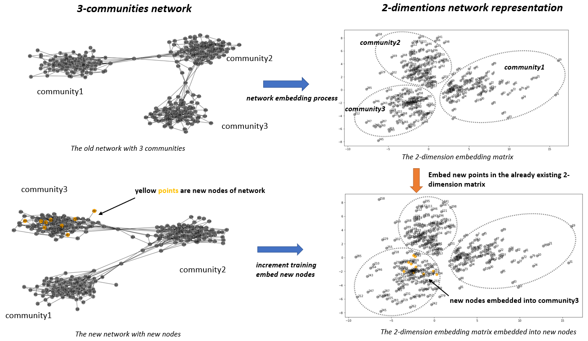

## Introduction:  Network Embedding (DeepWalk Method)Applications
- **Network embedding methods aim at learning low-dimensional latent representation of nodes
in a network**. These representations can be used as features for a wide range of tasks on graphs
such as classification, clustering, link prediction, and visualization
- As we know,Given a network’s structure, **it is often desirable to predictmissing information (frequently called attributes or labels)** associated with each node in the graph,for exmaple on a social
network they might represent the communities a person belongs to, or the categories of a document’s
content on the web but in the real-world social network, information networks can contain billions of nodes and edges and the adjacency matrix (graph 1), a traditional way to present a network is intractable to perform complex inference procedures on the entire network.
- One technique which has been proposed to address this problem is network embedding. The central idea is to find a mapping
function which converts each node in the network to a low-dimensional latent representation. These
representations can then be used as features for common tasks on graphs such as classification,
clustering, link prediction, and visualization.

- Scenario: I create the random connected network with 500 nodes to demostrate the application of network embedding. You can see the social network has 3 communities (graph 2). We convert it to be a 2 dimension graph (graph 3)

References:
Haochen Chen, Bryan Perozzi2, Rami Al-Rfou2, and Steven Skiena1: A Tutorial on Network Embeddings. August 9, 2018
https://arxiv.org/pdf/1808.02590.pdf

# Increment training of Network Embedding
- Introduction : Network Embedding is known as a dimension reduction algorithm to represent and extract features from high-dimension. As we known,typical algorithms like SVD,PCA and MDS if a high-dimension matrix has a slight change we need process dimension reduction again but we do not need to train the network again if we are using network embedding methods to do dimension reduction. 
- Advatages:Due  to this superior characteristics, network emedding method saves a lot of computing resource and can be a fast-changing and real-time method to represent user's features because we only need to train new nodes instead of re-training whole graph.
- Application scenario Take social networks as an example, when new users register and have connections others, the graph of network should be different and we need to have new features to represent those new users like which commmunities they belong to.

This jupyter notebook shows an example of how to do increment training of existing embedding matrix when new nodes appear
: we already have trained embedding network of 290 nodes but now we increment training to know their features and which communitiy they should beglong to 

